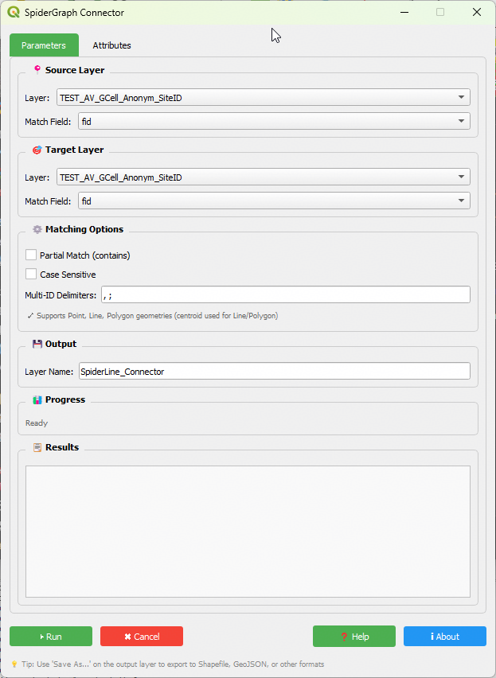
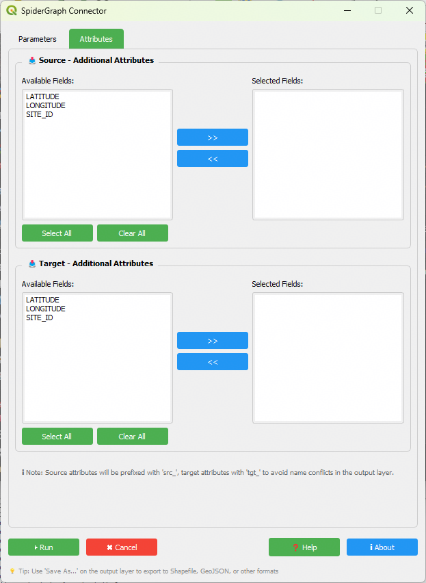

# SpiderGraph Connector

**SpiderGraph Connector** is a QGIS plugin for creating spatial connection lines between two layers using flexible field matching.

It is designed for **telecom engineers and spatial analysts** who need to visualize relationships between datasets such as sites, cells, or infrastructure.

---

## 🚀 Key Features

- 🔗 One-to-many connection mapping  
- 🧩 Multi-ID field parsing (comma, semicolon, etc.)  
- 📊 Attribute enrichment (src_ / tgt_ fields)  
- 📍 Supports Point, Line, Polygon (auto centroid)  
- ⚙ Flexible matching:
  - Exact match  
  - Partial match (contains)  
  - Case-sensitive option  

---

## 🛠 Installation (Manual)

1. Download SpiderGraph_Connector_v1.0.0.zip
2. Go to **Plugins → Manage and Install Plugins**  
3. Go to **Tab "Install from ZIP" → Browse file SpiderGraph_Connector_v1.0.0.zip → click "Install Plugins"**
4. Go to **Enable "SpiderGraph Connector"**  
5. Restart QGIS 

---

## 📸 Screenshots

### SpiderGraph UI

---

## 📌 How to Use

1. Select **Source Layer**  
2. Select **Target Layer**  
3. Choose matching fields  
4. (Optional) Select additional attributes  
5. Configure matching options  
6. Click **Run**

### Output

- Line connections between matched features  
- Attributes from both layers (with prefix `src_` and `tgt_`)  

---

## 💡 Use Cases

- Telecom site-to-cell mapping  
- Neighbor relation visualization  
- Infrastructure linkage analysis  
- Spatial data validation  

---

## 👤 Author

**Achmad Amrulloh (Dinzo)**  
📧 achmad.amrulloh@gmail.com  
🔗 https://www.linkedin.com/in/achmad-amrulloh/

---

## ⚠ Notes

This plugin is currently distributed outside the official QGIS plugin repository  
and is intended for early users, testing, and feedback.

---

## ⭐ Support

If you find this tool useful:

- Share it with your team  
- Provide feedback  
- Contribute ideas  

---